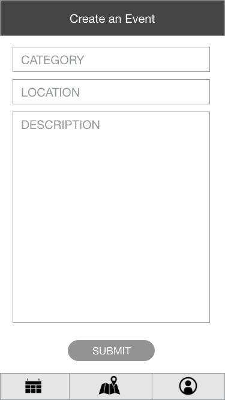
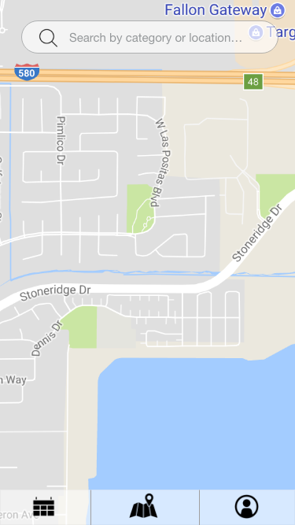
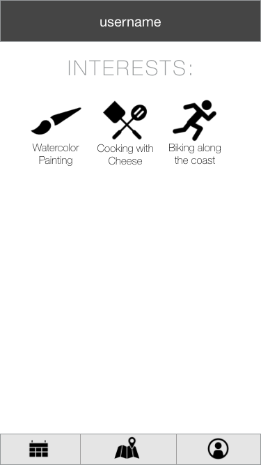
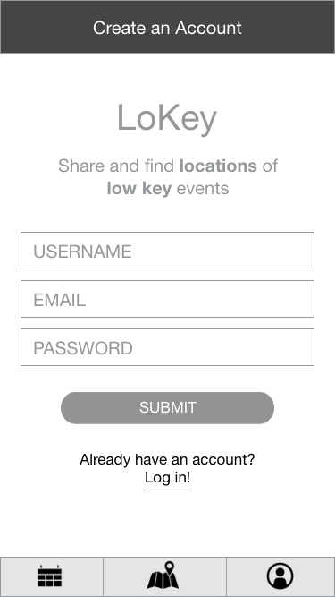
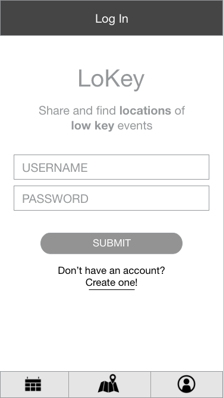
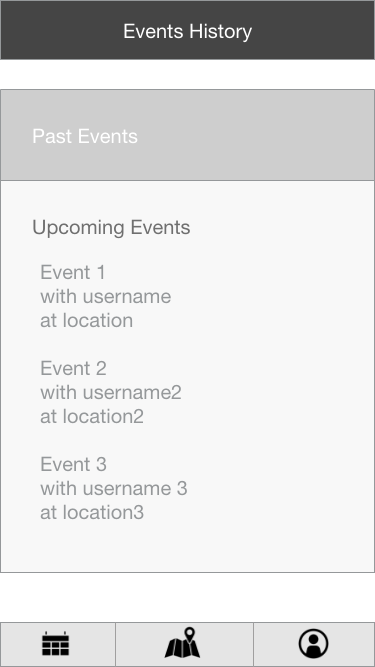

# LoKey
### LoKey implements the Google Maps API and React native to create a location-aware app to allow strangers to connect and share in unique activities.

## Background and Overview
LoKey is a social peer-to-peer meetup app utilizing React Native that allows users to connect with one another to participate in low-key activities in their local area. LoKey is designed specifically with obscure and underappreciated hobbies and activities-- as well as their participants-- in mind, allowing users to come together, make new connections, and create memorable experiences doing things they enjoy with other likeminded people who enjoy them too.

## Functionality & MVP
Utilizing Google Maps API, users will be able to view and search for various activities taking place in their area.

### MVPs
* Secure frontend-to-backend user authentication using BCrypt
* Display map through Google API of local area
* Display activites on map; allow users to create / join activites
* Search / filter events

#### Bonus Features
 + User-requested activity types
 + In-app event-oriented chat system

## Technologies & Technical Challenges
  This will be our first React Native app, so we will be wrangling all the errors and gotchas that get greenhorns. We will be working with form elements, and using a map component. Besides working with Google's API to produce a map, we will be requesting data from our backend and displaying it as markers on said map. There are several things at play here:

  - Getting a Ruby on Rails backend to work together with a React Native app Frontend
  - Working with Google Maps' API... in React Native
  - Working in React Native for the 1st time.

#### Seeding the Database
  + ##### Whitelisting Activities
    + LoKey is not a dating app. Users should not be able to post activities like "*m4w 19y/o bbw pref*". LoKey will initially have common activities, after which more will be added. Common activities may be like:
     - Catch
     - Sculpting
     - Painting
     - Unicycling
     - Banana Juggling

  + ##### Initial Events
    + The creators will place activities on the app's map.

#### Map
 + We will use Google Map's API
 + AirBnB has a [React Google Maps](https://github.com/airbnb/react-native-maps) component which may be used.
  - This map component has an easy-to-use MapMarker feature, where MapMarkers may be shown. They just need coordinates. We can create custom views for the markers, and upon clicking a marker, take the user to an Event#show scene.

#### Creating a seamless mobile experience
  + ##### _Including bonus MVP's_, users should be able to place & find events, and coordinate with **event hosts**, all using the app.
    + Without bonus MVP's, users should be able to place and find events, and have a means of contacting event hosts.


#### Frontend Interface
  + Implemented in React Native
  + There will be 5+ scenes including:
    - Account Creation / Signup
    - Event Creation / Edit
    - Event Show
    - User Dashboard
    - Map
  + These scenes entail creating forms in React native, as well as a filter/search bar and navbar components.

#### Backend
   + Ruby on Rails with PostgreSQL will store:
     - User information
     - Events with coordinates to be displayed on a map
     - Event Types, conceptually similar to tags

## Project Flowchart

### Create Event


### Map


### User Dashboard


### New User Registration


### Signup


### Calendar



## Accomplished over the Weekend

+ Familiarized with Create-React-Native-App and the Expo client which emulates an app, live, on one's phone
+ Researched React Native and the most important component, a map
  - Played with AirBnB's react native map component, which provides everything this project's MVP's need
+ Created a Ruby on Rails backend in the ```backend``` folder, which still needs routes and controllers.
  - Has a polymorphic association for the ```coordinate``` model!
+ Created a React Native app in the ```/frontend``` folder

## Group Members & Work Breakdown

**Sunayna Bhikha**,
**Joseph Bieze**,
**Joseph Burger**,

## Phase One: Learn New Technologies

* All group members will dedicate time to learn React Native.
* Emulators will be set up on each group member's machine.
* Majority of Rails Backend will be constructed.
* Set up routes.
* Proposal README will be complete.

## Phase Two: Users

* User Authentication (1 day)
  + Set up user authentication for both frontend and backend.
  + Users should be able to create an account and log in. Log in should persist.

* User Profiles + NavBar (1 day)
  + User profile page will display interests.
  + NavBar should be created with links to the appropriate scenes.

## Phase Three: Functional Components

* Create an Event + Event Index (1 day)
  + Build form for users to create events.
  + Event Index will include information pertaining to both past and future events.

* Map Page (3 days)
  + Set up Google Maps API.
  + Create functionality for filtering events by location, event name or username.
  + Default markers should appear when map scene is first opened.
  + Default search radius should also be implemented
  + Markers should appear according to search results

## Phase Four: Final Touches (1 day)
* Final styling and UI touches
* Launch app on App Store and Google Play Store.

## Plan for getting users and reviews.

* Craft a general email to send out to all cohort-mates and friends and family of group members.

* Send out email and follow up as needed.

* Until we reach our goal of ~40 users and 15 reviews, we will continue to follow up with people we reached out to.
